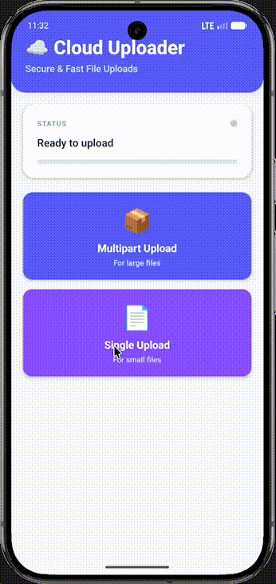

<a href="https://gauthamvijay.com">
  <picture>
    
  </picture>
</a>

# react-native-nitro-cloud-uploader

**React Native Nitro Module** for **reliable, resumable, background-friendly uploads** of large files (audio, video, images, PDFs) to **S3-compatible storage** — built for real production workloads.

---

> [!NOTE]
>
> - This library was originally created for my production app, where we needed to upload **long audio recordings** and large media files directly from the device — reliably, even when the app was in the background.
> - It works great with **multipart presigned URLs** for:
>   - Cloudflare R2
>   - Backblaze B2
>   - Any S3-compatible bucket
> - I haven't tested AWS S3 yet, but it should work without changes.
>
> If you need mobile uploads of **huge files** to S3-compatible storage, this library gives you everything you need out of the box.

---

## 📦 Installation

```bash
npm install react-native-nitro-cloud-uploader react-native-nitro-modules
```

> [!IMPORTANT]
>
> - **iOS**: Fully tested and production-ready ✅
> - **Android**: Implementation complete with full feature parity ✅
>   - Background uploads via ForegroundService
>   - Progress notifications
>   - Network drop/restore handling
>   - Pause/Resume/Cancel controls
>   - Requires Android 7.0+ (API 24+)
> - Tested only for React Native 0.81.0 and above. PRs welcome for lower RN versions to make it work and stable for lower versions.

---

## 🎥 Demo

<table>
  <tr>
    <th align="center">🍏 iOS Demo</th>
    <th align="center">🤖 Android Demo</th>
  </tr>
  <tr>
    <td align="center">
    
    </td>
     <td align="center">
    
    </td>
  </tr>
</table>

---

> [!NOTE]
>
> S3 multipart **PUT** uploads require a **minimum chunk size of 5 MB**, so this library defaults to splitting files into 5 MB parts to prevent upload issues.
>
> You must implement your own backend endpoint to generate the multipart presigned URLs. Once provided, the library automatically handles uploading each part and storing the returned **ETag** values for you.
> Demo showcases uploading to cloudflare R2 Bucket

```tsx
const BASE_URL = 'https://your-api.workers.dev';
const CREATE_UPLOAD_URL = `${BASE_URL}/create-and-start-upload`;
const COMPLETE_UPLOAD_URL = `${BASE_URL}/complete-upload`;
const ABORT_UPLOAD_URL = `${BASE_URL}/abort-upload`;
const ABORT_UPLOAD_URL = `${BASE_URL}/abort-upload`;
const SINGLE_UPLOAD_URL = `${BASE_URL}/single-upload`;
```

---

## 🧠 Overview

| Feature                           | Implementation                            |
| --------------------------------- | ----------------------------------------- |
| Large file uploads (audio/video)  | Native                                    |
| Multipart / presigned URL uploads | S3-compatible                             |
| Cloudflare R2                     | Tested                                    |
| Backblaze B2                      | Tested                                    |
| S3-compatible storage             | Standard API                              |
| Background uploads                | URLSession.background / ForegroundService |
| Pause/Resume                      | Task suspension                           |
| Cancel                            | Job cancellation                          |
| Network monitoring                | Auto-pause/resume on connection loss      |
| Progress tracking                 | Real-time events                          |
| Progress notifications            | Native notifications                      |
| Parallel chunk uploads            | Configurable (default: 3)                 |
| ETag collection                   | Automatic                                 |

---

## ⚙️ Basic Usage

```tsx
import { CloudUploader } from 'react-native-nitro-cloud-uploader';

const createResponse = await fetch(CREATE_UPLOAD_URL, {
  method: 'POST',
  headers: { 'Content-Type': 'application/json' },
  body: JSON.stringify({
    uploadId: newUploadId,
    fileSize,
    chunkSize: 6 * 1024 * 1024, // 6MB chunks for safe chunk uploads
  }),
});

await CloudUploader.startUpload(newUploadId, filePath, uploadUrls, 3, true);
```

---

## 🧩 Supported Platforms

| Platform             | Status             |
| -------------------- | ------------------ |
| **iOS**              | ✅ Fully Supported |
| **Android**          | ✅ Fully Supported |
| **iOS Simulator**    | ✅ Works           |
| **Android Emulator** | ✅ Works           |

### Android Requirements

**Minimum SDK**: API 24 (Android 7.0)

**Required Permissions** (automatically added):

- `INTERNET` - Network uploads
- `ACCESS_NETWORK_STATE` - Network monitoring
- `POST_NOTIFICATIONS` - Progress notifications (Android 13+)
- `FOREGROUND_SERVICE` - Background uploads
- `FOREGROUND_SERVICE_DATA_SYNC` - Data sync service type
- `WAKE_LOCK` - Keep CPU awake during uploads

**Runtime Permission for Android 13+**:

For devices running Android 13+ (API 33+), you must request the `POST_NOTIFICATIONS` permission at runtime to show upload progress notifications:

```tsx
import { PermissionsAndroid, Platform } from 'react-native';

// Request notification permission before starting uploads
if (Platform.OS === 'android' && Platform.Version >= 33) {
  const granted = await PermissionsAndroid.request(
    PermissionsAndroid.PERMISSIONS.POST_NOTIFICATIONS
  );

  if (granted === PermissionsAndroid.RESULTS.GRANTED) {
    console.log('Notification permission granted');
  } else {
    console.log(
      'Notification permission denied - uploads will work without notifications'
    );
  }
}
```

> **Note**: The library will gracefully skip notifications if permission is denied. Uploads will continue to work normally.

---

## 🤝 Contributing

Contributions are welcome!

- [Development Workflow](CONTRIBUTING.md#development-workflow)
- [Sending a Pull Request](CONTRIBUTING.md#sending-a-pull-request)
- [Code of Conduct](CODE_OF_CONDUCT.md)

---

## 🪪 License

MIT © [**Gautham Vijayan**](https://gauthamvijay.com)

---

Made with ❤️ and [**Nitro Modules**](https://nitro.margelo.com)
